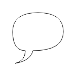
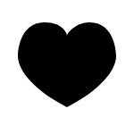
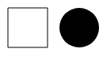

## 使用canvas来绘制图形

### 绘制矩形 
- `fillRect(x, y, width, height)` : 绘制一个填充的矩形
- `strokeRect(x, y, width, height)` : 绘制一个矩形的边框
- `clearRect(x, y, width, height)` : 清除指定矩形区域，让清除部分完全透明。
- `rect(x, y, width, height)` : 绘制一个左上角坐标为（x,y），宽高为width以及height的矩形。
```JS
function draw() {
  var canvas = document.getElementById('canvas');
  if (canvas.getContext) {
    var ctx = canvas.getContext('2d');

    ctx.fillRect(25, 25, 100, 100);
    ctx.clearRect(45, 45, 60, 60);
    ctx.strokeRect(50, 50, 50, 50);
  }
}
```

### 绘制路径
- `beginPath()` :
新建一条路径，生成之后，图形绘制命令被指向到路径上生成路径。
- `moveTo()` :
指定绘制的起始位置。
- `closePath()` :
闭合路径之后图形绘制命令又重新指向到上下文中。
- `stroke()` :
通过线条来绘制图形轮廓。
- `fill()` :
通过填充路径的内容区域生成实心的图形。

```js
/// 绘制一个三角形
function draw() {
  var canvas = document.getElementById('canvas');
  if (canvas.getContext) {
    var ctx = canvas.getContext('2d');

    ctx.beginPath();
    ctx.moveTo(75, 50);
    ctx.lineTo(100, 75);
    ctx.lineTo(100, 25);
    ctx.fill();
  }
}
```
```js
/// 绘制笑脸
function draw() {
 var canvas = document.getElementById('canvas');
 if (canvas.getContext){
 var ctx = canvas.getContext('2d');

    ctx.beginPath();
    ctx.arc(75,75,50,0,Math.PI*2,true); // 绘制
    ctx.moveTo(110,75);
    ctx.arc(75,75,35,0,Math.PI,false);   // 口(顺时针)
    ctx.moveTo(65,65);
    ctx.arc(60,65,5,0,Math.PI*2,true);  // 左眼
    ctx.moveTo(95,65);
    ctx.arc(90,65,5,0,Math.PI*2,true);  // 右眼
    ctx.stroke();
 }
}
```

### 线
- `lineTo(x, y)`：绘制一条从当前位置到指定x以及y位置的直线。

```js
/// 绘制两个三角形，一个是填充的，另一个是描边的
function draw() {
 var canvas = document.getElementById('canvas');
 if (canvas.getContext){
    var ctx = canvas.getContext('2d');

    // 填充三角形
    ctx.beginPath();
    ctx.moveTo(25,25);
    ctx.lineTo(105,25);
    ctx.lineTo(25,105);
    ctx.fill();

    // 描边三角形
    ctx.beginPath();
    ctx.moveTo(125,125);
    ctx.lineTo(125,45);
    ctx.lineTo(45,125);
    ctx.closePath();
    ctx.stroke();
 }
}
```

### 圆弧
- `arc(x, y, radius, startAngle, endAngle, anticlockwise)`：画一个以（x,y）为圆心的以radius为半径的圆弧（圆），从startAngle开始到endAngle结束，按照anticlockwise给定的方向（默认为顺时针）来生成。
- `arcTo(x1, y1, x2, y2, radius)`：根据给定的控制点和半径画一段圆弧，再以直线连接两个控制点。

这里详细介绍一下arc方法，该方法有六个参数：`x,y`为绘制圆弧所在圆上的圆心坐标。`radius`为半径。`startAngle`以及`endAngle`参数用弧度定义了开始以及结束的弧度。这些都是以`x`轴为基准。参数`anticlockwise`为一个布尔值。为`true`时，是逆时针方向，否则顺时针方向。
> 注意：`arc()`函数中表示角的单位是**弧度**，不是角度。角度与弧度的`js`表达式:
`弧度=(Math.PI/180)*角度`。

```js
/// 绘制了12个不同的角度以及填充的圆弧
function draw() {
 var canvas = document.getElementById('canvas');
 if (canvas.getContext){
    var ctx = canvas.getContext('2d');

    for(var i=0;i<4;i++){
        for(var j=0;j<3;j++){
            ctx.beginPath();
            var x = 25+j*50; // x 坐标值
            var y = 25+i*50; // y 坐标值
            var radius = 20; // 圆弧半径
            var startAngle = 0; // 开始点
            var endAngle = Math.PI+(Math.PI*j)/2; // 结束点
            var anticlockwise = i%2==0 ? false : true; // 顺时针或逆时针

            ctx.arc(x, y, radius, startAngle, endAngle, anticlockwise);

            if (i>1){
            ctx.fill();
            } else {
                ctx.stroke();
            }
        }
    }
 }
}
```

### 二次贝塞尔曲线及三次贝塞尔曲线
- `quadraticCurveTo(cp1x, cp1y, x, y)`：
绘制二次贝塞尔曲线，`cp1x,cp1y`为一个控制点，`x,y`为结束点。
- `bezierCurveTo(cp1x, cp1y, cp2x, cp2y, x, y)`：
绘制三次贝塞尔曲线，`cp1x,cp1y`为控制点一，`cp2x,cp2y`为控制点二，`x,y`为结束点。

下图能够很好的描述两者的关系，二次贝塞尔曲线有一个开始点（蓝色）、一个结束点（蓝色）以及一个控制点（红色），而三次贝塞尔曲线有两个控制点。
参数`x、y`在这两个方法中都是结束点坐标。`cp1x,cp1y`为坐标中的第一个控制点，`cp2x,cp2y`为坐标中的第二个控制点。


```js
/// 使用多个贝塞尔曲线来渲染对话气泡
function draw() {
 var canvas = document.getElementById('canvas');
 if (canvas.getContext) {
    var ctx = canvas.getContext('2d');

    // 二次贝塞尔曲线
    ctx.beginPath();
    ctx.moveTo(75,25);
    ctx.quadraticCurveTo(25,25,25,62.5);
    ctx.quadraticCurveTo(25,100,50,100);
    ctx.quadraticCurveTo(50,120,30,125);
    ctx.quadraticCurveTo(60,120,65,100);
    ctx.quadraticCurveTo(125,100,125,62.5);
    ctx.quadraticCurveTo(125,25,75,25);
    ctx.stroke();
  }
}
```


```js
/// 使用贝塞尔曲线绘制心形
function draw() {
 var canvas = document.getElementById('canvas');
 if (canvas.getContext){
    var ctx = canvas.getContext('2d');
    //三次贝塞尔曲线
    ctx.beginPath();
    ctx.moveTo(75,40);
    ctx.bezierCurveTo(75,37,70,25,50,25);
    ctx.bezierCurveTo(20,25,20,62.5,20,62.5);
    ctx.bezierCurveTo(20,80,40,102,75,120);
    ctx.bezierCurveTo(110,102,130,80,130,62.5);
    ctx.bezierCurveTo(130,62.5,130,25,100,25);
    ctx.bezierCurveTo(85,25,75,37,75,40);
    ctx.fill();
  }
}
```


### `Path2D` 对象
`Path2D()`会返回一个新初始化的`Path2D`对象（可能将某一个路径作为变量——创建一个它的副本，或者将一个包含`SVG` `path`数据的字符串作为变量）。
- `new Path2D();`     // 空的Path对象
- `new Path2D(path);` // 克隆Path对象
- `new Path2D(d);`    // 从SVG建立Path对象

所有的路径方法比如`moveTo`, `rect`, `arc`或`quadraticCurveTo`等，如我们前面见过的，都可以在`Path2D`中使用。

`Path2D API` 添加了 `addPath`作为将`path`结合起来的方法。当你想要从几个元素中来创建对象时，这将会很实用。比如：

- `Path2D.addPath(path [, transform])​`：
添加了一条路径到当前路径（可能添加了一个变换矩阵）。

```js
/// 在这个例子中，我们创造了一个矩形和一个圆。它们都被存为Path2D对象，后面再派上用场。随着新的Path2D API产生，几种方法也相应地被更新来使用Path2D对象而不是当前路径。在这里，带路径参数的stroke和fill可以把对象画在画布上。
function draw() {
  var canvas = document.getElementById('canvas');
  if (canvas.getContext){
    var ctx = canvas.getContext('2d');

    var rectangle = new Path2D();
    rectangle.rect(10, 10, 50, 50);

    var circle = new Path2D();
    circle.moveTo(125, 35);
    circle.arc(100, 35, 25, 0, 2 * Math.PI);

    ctx.stroke(rectangle);
    ctx.fill(circle);
  }
}
```


新的`Path2D API`有另一个强大的特点，就是使用SVG path data来初始化canvas上的路径。这将使你获取路径时可以以`SVG`或`canvas`的方式来重用它们。

这条路径将先移动到点` (M10 10)` 然后再水平移动80个单位`(h 80)`，然后下移80个单位 `(v 80)`，接着左移80个单位 `(h -80)`，再回到起点处`(z)`。你可以在[Path2D constructor](https://developer.mozilla.org/en-US/docs/Web/API/Path2D.Path2D#Using_SVG_paths) 查看这个例子。
```js
var p = new Path2D("M10 10 h 80 v 80 h -80 Z");
```