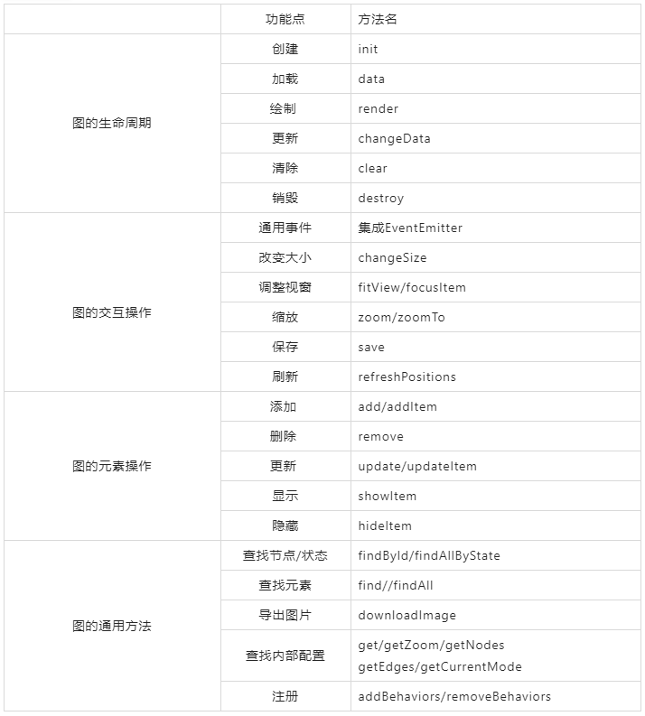
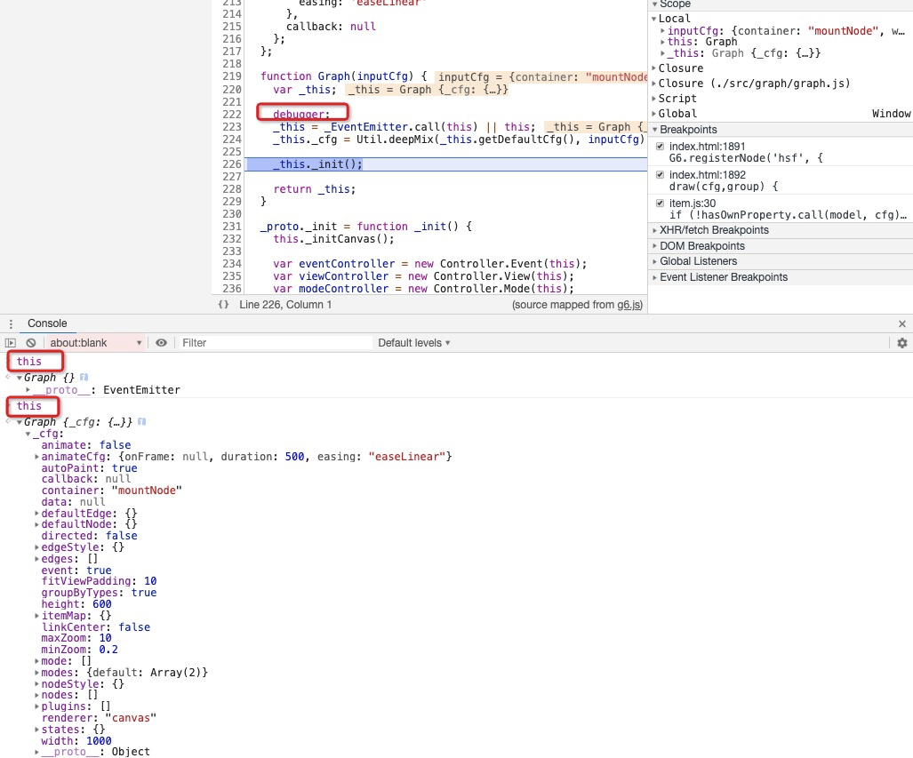
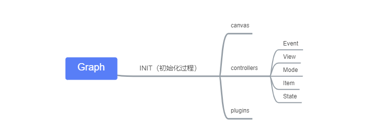
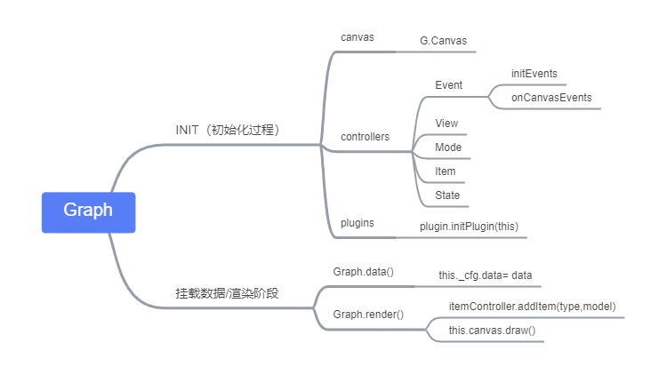

# G6源码阅读-part1-运行主流程
原文：https://www.yuque.com/antv/g6/gbc3i3

> 今天我们开始从零学习g6的源码，为什么学习源码呢，因为框架源码相比于业务代码，会有让我们体会到更多的架构设计方案。在关系可视化这一领域，理解并能实现G6，也是我们关系可视化工程能力的一部分。

在看源码之前，我们一定要带着问题来看。还记得我们《从零绘制关系图-1 Simple Graph》吗？我们用最直观最原始的方式实现了一个简单关系图。那么如果由小见大，把它做成一个框架，应该是什么样子的呢？
- 1.点和边的数据类型定义  ===> `G6.Config`
- 2.定义节点和边的位置，xy坐标  ===> `G6.Layout`
- 3.通过canvasAPI批量绘制节点和边 ===> `G6.Render`

以上是我们的猜想，那我们看着G6的源码，看它是如何在框架层面解决这些问题

## 1.熟悉版本演变历史与顶层API设计
> G6 3.0 重构的目的：
> - 提供更简单、易用的接口
> - 更好的性能
> - 满足图分析需求


通过顶层的API设计，我们可以猜想出 G6的 实例化方法应该是 Graph，未来随着业务的不同，可以扩展出：
- Graph：通用图可视化
- TreeGraph：树图
- AnalyzerGraph：分析图
- ...

G6的扩展性设计都在Register方法里：
- registerNode：自定义节点
- registerEdge：自定义边
- registerBehavior：自定义行为/事件


## 2.验证之前的想法，得到新的输入
> 通过顶层API，我们直接看src/graph/graph.js，看这个文件中能否得到我们之前的猜想验证答案

我们找到了第一个答案 `1.点和边的数据类型定义  ===> G6.Config`,G6中不仅仅是点和边的数据类型存储，它还包含了很多很多用户配置，这些都在getDefaultCfg中。而多出来的配置，就是给我们新的输入，这些输入可能是我们通过简单的关系图绘制没考虑到的，比如缩放事件，动画等。
```js
Class  Graph extends EventEmitter {
  getDefaultCfg() {
      return { 
        nodes: [],
        edges: [],
        itemMap: {},
        minZoom：0.2
        ...
  }
  constructor(inputCfg) {
      super();
      //在G6中数据结构和用户配置 存放在_this._cfg中
      this._cfg = Util.deepMix(this.getDefaultCfg(), inputCfg);  
      this._init();
    }
}
```
## 3.粗略梳理，看清脉络---分析Graph类
> graph.js 文件很长，大概有992行，一行行看下去肯定不明智。快速的梳理能让我们抓住核心，了解其设计想法。我在这里归纳总结表格下：



## 4.通过debug，了解运行全过程
> 了解`Graph.js`后，我们就不能再肉眼看代码了（除非你经验很丰富）我们需要启动G6的DEMO，通过再源码中打断点，分析运行全过程

- 打开package.json文件，找到项目的编译入口，执行下面的命令，可以开启本地web-demo服务和 源码编译的watch模式

```
npm run dev 
```
我们打开 `image-node` 这个`demo`，看到`G6`官方写的`demo`

```js
 const graph = new G6.Graph({
    container: 'mountNode',
    width: 1000,
    height: 600,
    modes: {
      default: ['drag-node','click-select']
    }
  });
  graph.data(data);
  graph.render();
  graph.on('node:click', e=> { console.log(e) })
```

emmm～这个时候，你需要泡一杯绿茶，边喝边调试，享受这个过程。

*记住随时在你的console中打印你需要验证的结果，源码分析最重要的就是带着问题去调试，带着猜想去验证。*




- 比如上图，我们知道`Graph`中的唯一属性是`_cfg`，下划线的命名方式大概是内部的属性，不想暴露给用户。
- 通过构造函数的执行，`Graph`实例this，有了`_cfg`的变化
`renderer:"canvas"`，看来默认的绘图方式是`canvas`
- 最大缩放是10，最小缩放是0.2
- ....还有很多猜想，不能急躁，喝口茶慢慢去验证

这个时候，断点来到了`this._init()`方法处，要不要进入就看你自己的选择，我们时间还很充裕，那就step into
```js
  _init() {
    this._initCanvas();
    const eventController = new Controller.Event(this);
    const viewController = new Controller.View(this);
    const modeController = new Controller.Mode(this);
    const itemController = new Controller.Item(this);
    const stateController = new Controller.State(this);
    this.set({
      eventController,
      viewController,
      modeController,
      itemController,
      stateController
    });
    this._initPlugins();
  }
```
在这里，我们一眼就可以看出来，这个controller是用来做代码切分的 code splitting。把graph实例对象传入不同的控制器中，然后得到的不同控制器实例再设置到_cfg中。这样Graph内部想用到和事件相关的处理逻辑，就在`this._cfg.eventController`中处理。既做到了代码分割，也满足了功能分割，很棒的操作。

> 俗话说，一图胜千文，对于一个框架而言，梳理其执行过程，最佳的方法就是整理思维导图




## 5.运行全流程-初始化阶段Init

接下来我就按照顺序来看下整个初始化过程

### initCanvas
- 本质是调用G的Canvas绘图方法，最终在将canvas实例挂载在_cfg属性上（可以通过console验证）

```js
const canvas = new G.Canvas({
      containerDOM: container,
      width: this.get('width'),
      height: this.get('height'),
      renderer: this.get('renderer'),
      pixelRatio: this.get('pixelRatio')
    });
this.set('canvas', canvas);
```

### InitGroup
- 伪代码：`canvas.addGroup("root").addGroup("Node/Edges")` 这个后续我们解释，用于递归绘制`Group`

### InitControllers
无论是事件/模式/视图/状态/元素 ，都是在构造函数中将`graph`实例绑定到`this`上，便于后续的处理。对于`EventController`，多一步初始化`events`事件

```js
const EVENTS = [
  'click',
  'mousedown',
  'mouseup',
  'dblclick',
  'contextmenu',
  'mouseenter',
  'mouseout',
  'mouseover',
  'mousemove',
  'mouseleave',
  'dragstart',
  'dragend',
  'drag',
  'dragenter',
  'dragleave',
  'drop'
];
 
_initEvents() {
    const self = this;
    const graph = self.graph;
    const canvas = graph.get('canvas');
     const canvasHandler = Util.wrapBehavior(self, '_onCanvasEvents');
    Util.each(EVENTS, event => {
      canvas.on(event, canvasHandler);
    });
  }
```
> *也就是说，所有的事件都绑定到`canvas`元素上。这个`handler`是`onCanvasEvents`。必然要在这个函数内部做事件代理，因为`canvas`上需要通过点击区域来判断是哪个元素触发了事件。这块可以参考`MDN canvas Hit_regions`*

### InitPlugins
通过代码，我们可以在知道`plugin`的使用方式是写在配置项里`_cfg`，因为`self.get('plugins')`,然后执行`initPlugin`方法，构造函数必然传入`graph`实例。

> 总结下，插件就是在外部提供一个核心运行实例供用户调用的机制

```js
 _initPlugins() {
    const self = this;
    Util.each(self.get('plugins'), plugin => {
      if (!plugin.destroyed && plugin.initPlugin) {
        plugin.initPlugin(self);
      }
    });
  }
```
## 6.运行全流程--data与render

### Graph.data()

> 将用户的数据，通过`set`方法，设置到`this._cfg.data`中

```js
 /**
   * 设置视图初始化数据
   * @param {object} data 初始化数据
   */
  data(data) {
    debugger;
    this.set('data', data);
  }
```


### Graph.render()
```js
render() {
    const self = this;
    const data = this.get('data');
    this.clear(); 
    Util.each(data.nodes, node => {self.add(NODE, node)});
    Util.each(data.edges, edge => {self.add(EDGE, edge)});
    self.paint();
    self.emit('afterrender');
  }
 clear() {
    const canvas = this.get('canvas');
    canvas.clear();
    this._initGroups();
    this.set({ itemMap: {}, nodes: [], edges: [] });
    return this;
  }
```
- Clear：
    1. 先调用`canvas`的`clear`，清空画布。原因是`Canvas`画布每次绘制前都需要清空，你可以理解它是新叠加一层画布，如果不想要之前底下的那层，就需要清除掉，详见`MDN` 
    2. 初始化`group` 
    3. 清除清空目前 `Graph` 上的节点和边实例
- 遍历所有的点和边，分别执行，通过这里我们可以认识到，原始的数据`data`对于`graph`来讲就是`model`

    ````js
    this.get('itemController').addItem(type, model)
    ````
- 调用`paint`方法绘制
    ```js
    paint() {
        this.emit('beforepaint');
        this.get('canvas').draw();
        this.emit('afterpaint');
    }
    ```

至此，我们就梳理出了Graph从启动到挂载数据，再到渲染的全流程。不过这里面有几个点我们或许很感兴趣：
- 原始的数据`nodes`，`edges` 如何转化成`Grpah`的`Node`和`Edge`实例
- 绘图调用`G.Canvas.draw`，底层绘图库`G`究竟是怎么运行的
- 事件代理`onCanvasEvents`到底是如何处理的？
- 自定义节点的机制是什么？

不急，我们慢慢梳理，以上运行过程是我们的第一部分，总结的思维导图如下，大家可以参考理解




