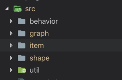
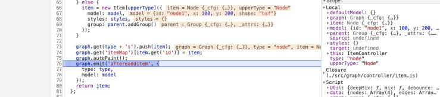
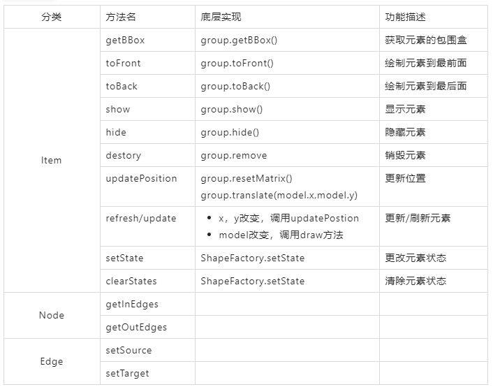
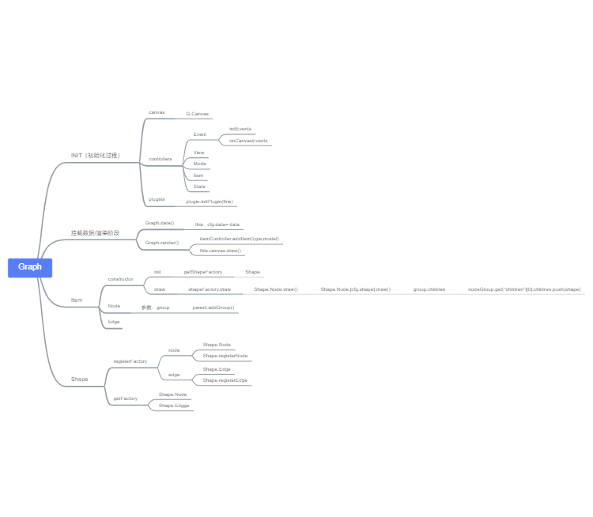

# G6源码阅读-Part2-Item与Shape
原文：https://www.yuque.com/antv/g6/hz2vzh
> 在part-1中我们重点讨论了G6启动的全流程。其实这个刚好就是graph文件所包含的内容，今天我们来讨论G6如何把用户的数据转化为节点实例，这里就涉及两个概念 `Item` 与 `shape`
- `Item`是宏观的，`nodes`数据转化为`Node`实例，`edges`数据转化为`Edge`实例
- `shape`是微观的，每个`Node`实例中包含多个`shape`图形，具体到在`canvas`层绘制的。

    

## `Item`

### `Graph.addItem`
> 通过part1的介绍，我们知道节点数据 通过addItem转化为G6的Item实例，核心代码如下
```js
addItem(type, model) {
    return this.get('itemController').addItem(type, model);
}
```
`debug`断点进入，发现它是将用户的数据`node` 作为`model`传入`Node`类中，同时将`Node`实例存储在`itemMap`中



**这里有两个关键点:**
- Item.Node 这个类是如何实现的？
- 创建实例的参数 parent.addroup()做了什么事情？

按照代码的执行顺序，我们先看parent.addGroup()

### `parent.addGroup()`

#### parent 是什么?
> 是在`initGroup`阶段，产生的`nodeGroup`。
```js
var parent = graph.get(type + 'Group') || graph.get('group');
```
#### `nodeGroup` 是什么？
> 是`canvas.addGroup("canvas-root").addGroup("canvas-node")`

```js
 _initGroups() {
    const canvas = this.get('canvas');
    const id = this.get('canvas').get('el').id;
    const group = canvas.addGroup({
      id: id + '-root',
      className: Global.rootContainerClassName
    });
    if (this.get('groupByTypes')) {
      const edgeGroup = group.addGroup({
        id: id + '-edge',
        className: Global.edgeContainerClassName
      });
      const nodeGroup = group.addGroup({
        id: id + '-node',
        className: Global.nodeContainerClassName
      });
      this.set({ nodeGroup, edgeGroup });
    }
    this.set('group', group);
  }
```
#### `canvas`是什么？
> `canvs`是由`new G.canvas()`实例化的对象
```js
const canvas = new G.Canvas({
      containerDOM: container,
      width: this.get('width'),
      height: this.get('height'),
      renderer: this.get('renderer'),
      pixelRatio: this.get('pixelRatio')
});
```
#### `G.canvas`是什么？
#### `addGroup`是什么？
#### ....

## summary
### 思路梳理
- `Item`是宏观上的，定义了`Node`和`Edge`的数据结构
- `Shape`是微观上的，定义了每个`Node`实例下的每个`Shape`是如何组合和定义的

> 用户把数据` {nodes,edges} ` 通过`addItem`方法灌入`G6`，`nodes`转化为`Node`实例，`edges`转化为`Edge`实例，也通过`group.addGroup`，分别加入`nodeGroup`的`children`和`edgeGroup`的`children`中。用户通过官方定义的节点或者自己定义的节点，在`draw`方法里调用`group.addShape`方法，将每个图形`shape`存储在所属`group`的`children`中。

### 类表如下


### 思维导图


