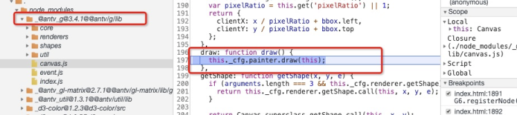
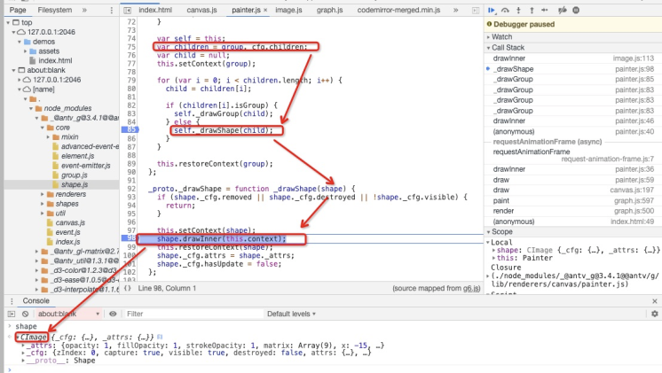
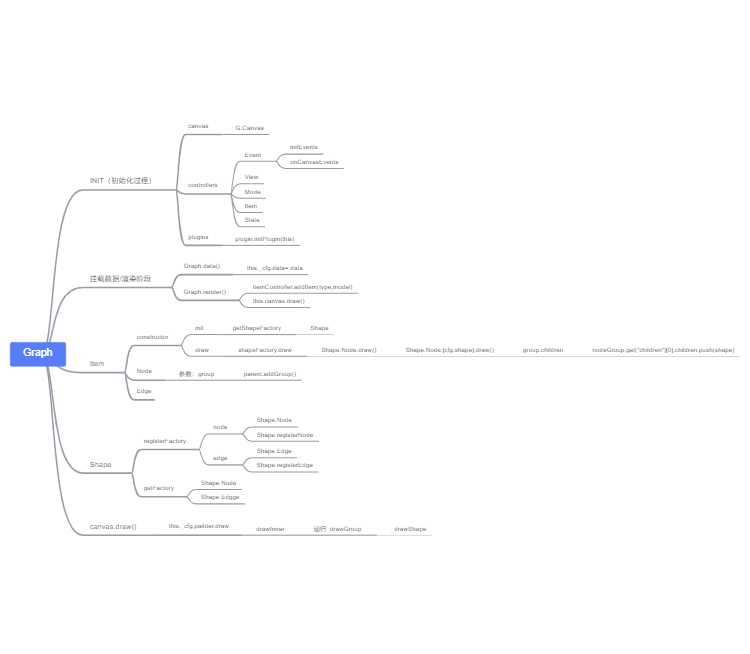

# G6源码阅读-part3-绘制Paint
原文：https://www.yuque.com/antv/g6/yb3hmn
> 在part-2中我们重点讨论了`G6`的数据灌入与`Node/Edge`实例的创建。第三章，我们来讨论，这些数据挂载在`group`中是如何绘制的。

这里的核心函数便是`canavs.draw()`

```js
render() {
    Util.each(data.nodes, node => { self.add(NODE, node)});
    Util.each(data.edges, edge => {self.add(EDGE, edge)});
    self.paint();
}
paint() {
  this.emit('beforepaint');
  this.get('canvas').draw();
  this.emit('afterpaint');
}
```



这块的逻辑是这样的。
- `G`支持`canvas`和`svg`两种绘图方式，因此`this._cfg.painter`就是通过用户配置的`render`后获取不同`painter`实例
- 查看下图的调用栈，可知，`draw --> _drawGroup-->`递归执行`_drawGroup`得到最后一层`children` 即用户添加`的shapes　--> `执行`drawShape`



## `shape`是谁？
是用户自定义`shape`，它由`group.addShape()`方法创建，实例化的过程如下 `/g/src/core/group.js`

`Shape`在  `/g/src/shapes/*.js`

```js
addShape(type, cfg) {
    const canvas = this.get('canvas');
    cfg.canvas = canvas;
    cfg.type = type;
    const rst = new Shape[shapeType](cfg);
    this.add(rst);
    return rst;
},
```
## `Shape.drawInner`在哪？

很显然，`Circle`实例的`drawInner`方法继承与`Shape`，`/g/src/core/shape.js` ,在父类`Shape`上，没有`createPath`等方法，需要子类自己去实现。

```js
Util.augment(Shape, isPointInPath, {
  isShape: true,
  drawInner(context) {
    const self = this;
    self.createPath(context);
    self.afterPath(context);
  },
})
```

## 核心！`createPath`

我们以`Circle`为例，`createPath`完成核心的绘制工作 `/g/src/shapes/circle.js`
这里就只有`canvas API`，[详见MDN](https://developer.mozilla.org/en-US/docs/Web/API/Canvas_API/Tutorial/Drawing_shapes)

```js
const Util = require('../util/index');
const Shape = require('../core/shape');

const Circle = function(cfg) {
  Circle.superclass.constructor.call(this, cfg);
};
 
Util.extend(Circle, Shape);
Util.augment(Circle, {
  type: 'circle',
  createPath(context) {
    const attrs = this._attrs;
    const cx = attrs.x;
    const cy = attrs.y;
    const r = attrs.r;
    context.beginPath();
    context.arc(cx, cy, r, 0, Math.PI * 2, false);
    context.closePath();
  }
});
module.exports = Circle;
```
