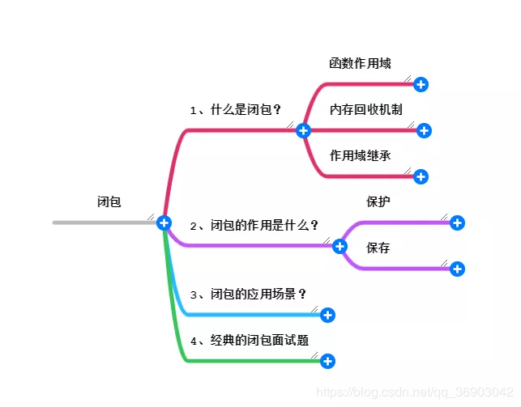
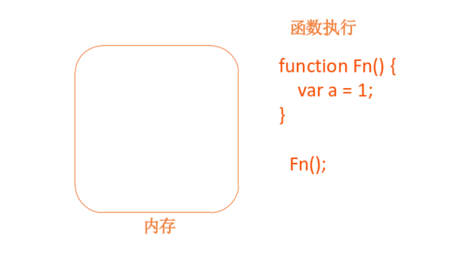
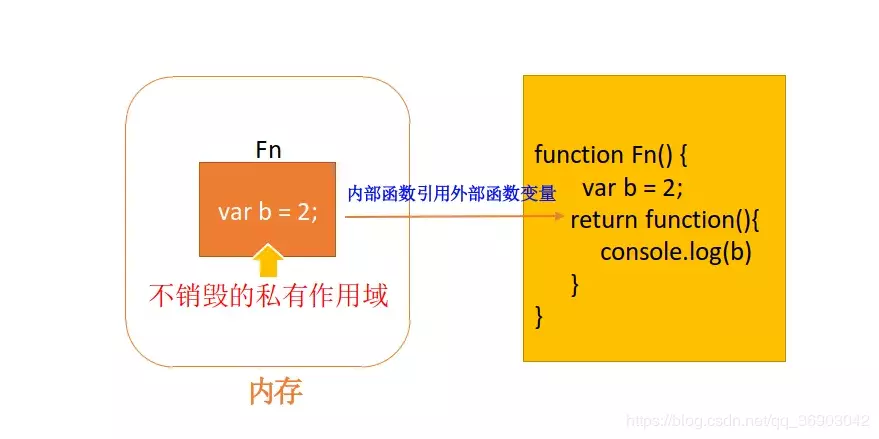
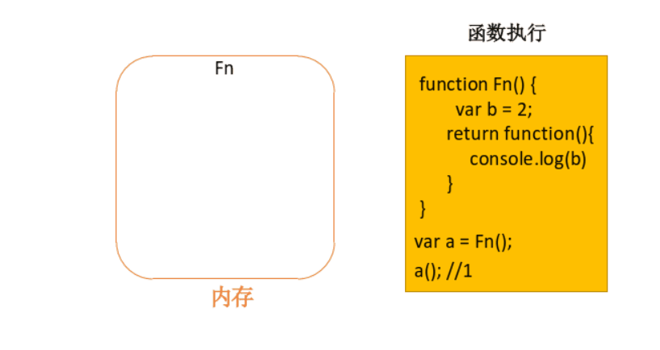
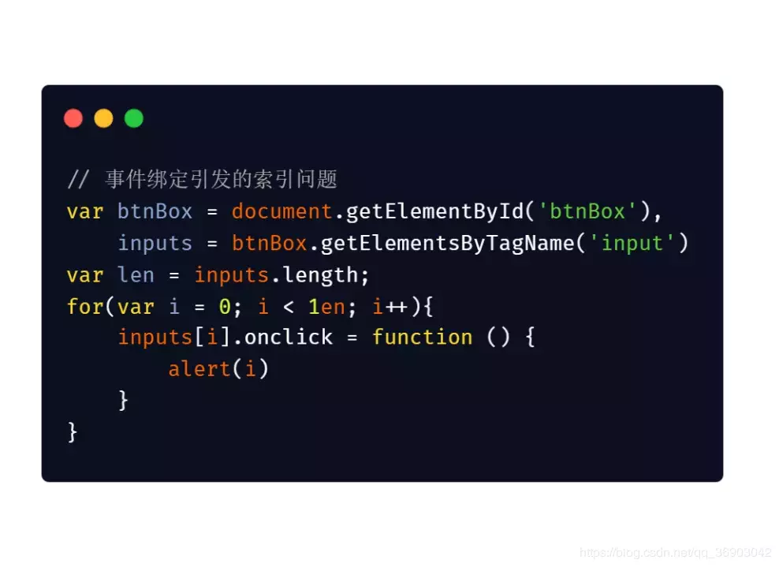
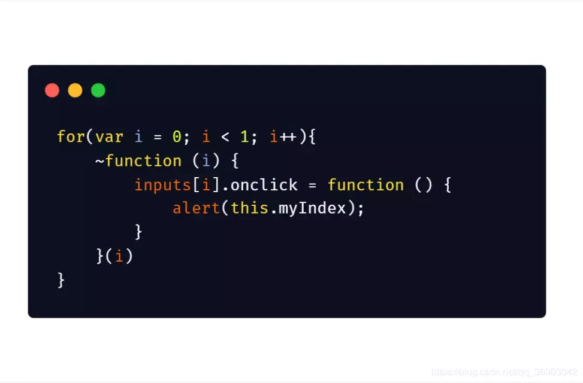
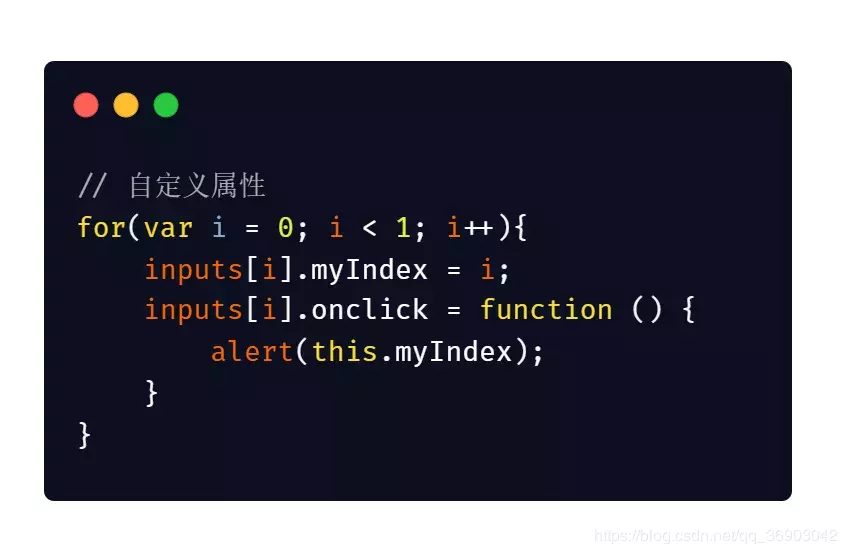
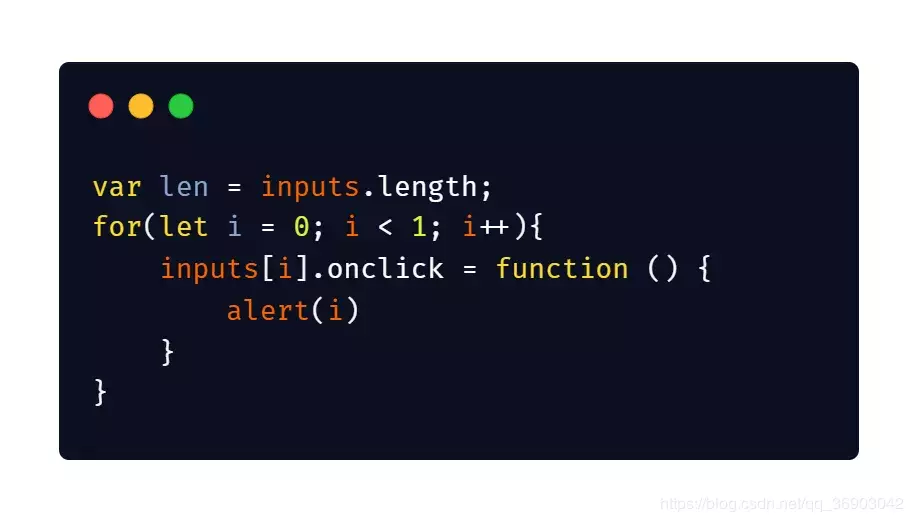

# 什么是闭包？
原文：https://juejin.im/post/5dc6449ae51d452bd321252c

## 思维导图


## 1、什么是闭包？
学习一个陌生的概念，我们首先要去明白是什么？也就是闭包是什么？要想完全掌握闭包，一定要清楚`函数作用域`、`内存回收机制`、`作用域继承`。我们就简单讲一下这几个概念。

### 1.1 函数作用域
作用域的概念，形象描述的话，可以认为它是一个封闭的空间，只允许在这个封闭的空间内进行一些操作，也将这个封闭空间称为私有作用域。在 JS 中，一个函数的执行就会在内存中创建一个私有作用域——封闭的空间。

```js
function Fn(){

}
```


比如在函数中定义一个变量，只能在函数这个私有作用域中使用（也就是封闭空间）。只要超出了这个作用域，就找不到该变量了。而且函数执行完成后，这个私有作用域（封闭的空间）就会销毁。有一种情况它是不会销毁的，那就是“闭包”，后边会讲到。

### 1.2 内存回收机制
内存回收机制就是不在用到的内存，我们系统就自动进行回收从而清理出空间供其他程序使用。那回收的规则是什么？



内部函数引用着外部的函数的变量，外部的函数尽管执行完毕，作用域也不会销毁。从而形成了一种不销毁的私有作用域。

某一变量或者对象被引用着，因此在回收的时候不会释放它，因为被引用代表着被使用，回收器不会对正在引用的变量或对象回收的。

### 1.3 作用域继承
所谓的作用域继承，就像是儿子可以继承父亲的财产一样。比如小鹿这里有一个大的盒子作为一个父级的作用域，然后在这个大的盒子里边放一个小的盒子，作为子作用域。我们规定可以在小盒子中获取到大盒子中的东西，大盒子不能获取小盒子里的东西就称为作用域继承。
```js
function Fn(){
    var a = 1;
    return function(){
        console.log(a);
    }
}
```
在 JS 中，道理是一样的，在一个函数里边我们再声明一个函数，内部函数可以访问外部函数作用域的变量，而外部的函数不能获取到内部函数的作用域变量。

那好，上边的这几个概念理解了之后，什么是闭包对你来说已经不是什么问题。

大白话说什么是闭包，那就是在一个函数里边再定义一个函数。这个内部函数一直保持有对外部函数中作用域的访问权限(小盒子一直可以有大盒子的访问权限)。

**函数执行，形成一个私有的作用域，保护里边的私有变量不受外界的干扰，除了保护私有变量外，还可以存储一些内容，这样的模式叫做`闭包`。**



```js
function Fn(){
    var a = 1;
    return function(){
        console.log(a);
    }
}

const b = Fn();
b();  // 1
```
## 2、闭包的作用是什么？
想必你对闭包还是有点懵懵懂懂，没关系，我们再继续深入了解。闭包主要的作用是什么呢？为什么要使用闭包呢？
通过上边对闭包的解释，外部函数 `return` 内部函数，但是仍然还是可以有访问外部函数的作用域，因为外部一直保持着引用。这就让我们发现它的可用之处。
不是有块作用域不销毁吗？我们可以用来保存一些内容，还可以用来保护一些私有的变量。我们总结出闭包有两个作用，分别为`保护和保存`。

## 3、闭包的应用场景

既然我们知道闭包的作用是保存和保护，那在实际项目中哪里用到了呢？

### 3.1 保护作用
团队开发时，每个开发者把自己的代码放在一个私有的作用域中，防止相互之间的变量命名冲突；把需要提供给别人的方法，通过 `return` 或` window.xxx `的方式暴露在全局下。

> `jQuery` 的源码中也是利用了这种保护机制。

### 3.2 保存作用

选项卡闭包的解决方案。我们经常在网页中使用选项卡，但是它存在一个问题，那就是索引引发的问题，其实和下边的经典面试题问题相同。

## 4、经典的闭包面试题
> 循环绑定事件引发的索引什么问题？怎么解决这种问题？



**此时运行程序，你会得出的结果都是 len 的数值**

为什么会出现这种问题，我们如何解决呢？

原因很简单，所有的事件绑定都是异步的，当触发点击事件，执行方法的时候，循环早就结束了。

我们在多说一点，什么是同步什么是异步？

- `同步：`JS 中当前这个任务没有完成，下面的任务都不会执行，只有等当前彻底完成，才会执行下面的任务。

- `异步：`JS 中的当前任务没有完成，需要等一会在完成，此时我们可以继续执行下面的任务。

**解决方案：**

当点击事件执行的时候，就会在私有作用域查找 i 的值，此时私有作用域没有 i ，就回去全局作用域查找，此时全局作用域的 i 已经被改变。所以说，要创建一个私有作用域的 i 。

方法一，闭包的方式。闭包终于排上用场了，用来保存私有的变量。



但是闭包解决又优点，也有缺点。优点就是通过创建私有作用域（闭包）方式解决，循环几次，就创建几个私有作用域（闭包），然后，每个私有作用域都有一个私有变量 i ，存的值分别是循环的值。
缺点是生成多个不销毁的私有作用域（堆内存），对性能有一定的影响。

方法二，使用自定义属性。我们给每个对象添加一个索引属性就 OK 了。



终极解决方案，这是 `ES6 `中的知识，因为之前在` JS `中是没有块级作用域的概念的，到了` ES6 `中就有了，`Let` 声明的变量就可以更好的解决上述问题。


